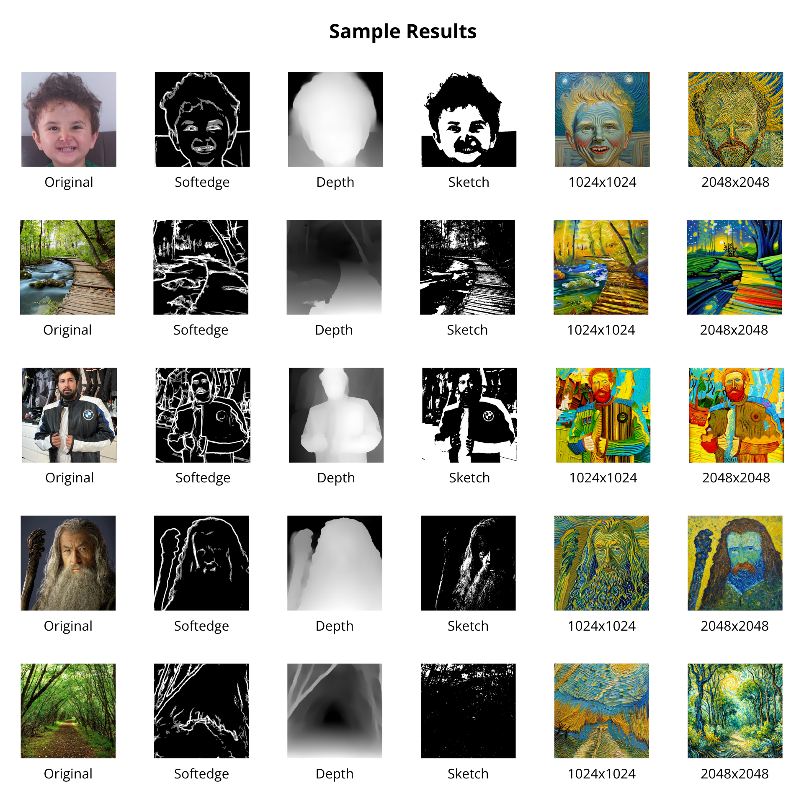
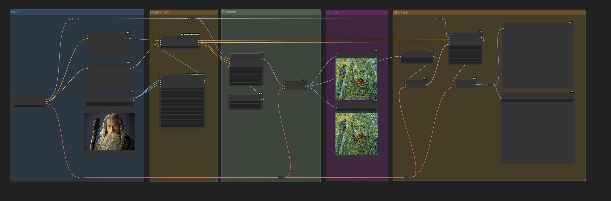
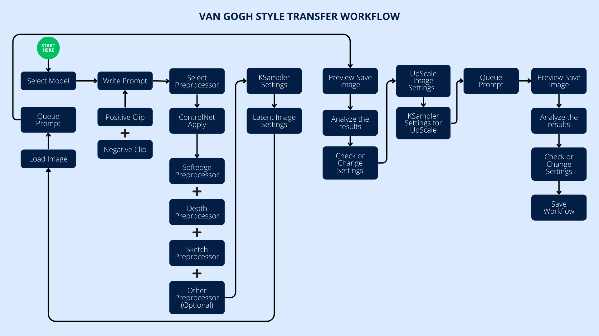

# 🎨 Transforming Images into Vincent van Gogh’s Style Using Multiple ControlNet in ComfyUI

## 📋 Project Overview

In this project, we will explore a workflow that transforms images into the “Vincent van Gogh Style” using ControlNet in ComfyUI. ControlNet will take your input image and convert it into a “Vincent van Gogh Style” output.

## 🎓 Sample Results

## 🛠️ Technical Requirements

- ComfyUI
- SDXL Model
- ControlNet Modules: You can customize the optional preprocessing nodes for Landscape or Portrait options.
    - Depth
    - Sketch-Scribble
    - Softedge
    - Canny (optional)
    - OpenPose (optional)
    - Lineart (optional)

## ❗ Pay Attention

If you haven't installed ComfyUI yet, you can download ComfyUI and ComfyUI Manager from the links below. There are different options for various operating systems.

- [ComfyUI](https://github.com/comfyanonymous/ComfyUI)
- [ComfyUI Manager](https://github.com/ltdrdata/ComfyUI-Manager)
- [ControlNet](https://github.com/lllyasviel/ControlNet)

### Custom Nodes:

Don’t forget to download the Custom Nodes file from the drive link provided in the project files!

Link: [Custom Nodes](https://drive.google.com/drive/folders/1I5kI1aw42ZbdLidC25Zhd_4o59oi4G-b?usp=sharing)

### Model:

Remember to download the model from the drive link located in the model folder!

Link: [Checkpoint SDXL 1.0 Model](https://drive.google.com/drive/folders/1OzR0OKJgbEwUX4pSCqrD6lAgss3Yc_6o?usp=sharing)

Afterwards, you can use the [`Multi_ControlNet_ComfyUI_VangoghStyle.json`](./Multi_ControlNet_ComfyUI_VangoghStyle.json) file within the project to install any missing nodes. You can also manually download the models from the links below.

- [SDXL Model](https://civitai.com/models/101055/sd-xl)
- [Edge Detection Models](https://education.civitai.com/civitai-guide-to-controlnet/)

Ensure that the models you download are SD XL compatible.

## 🔧 Optimal Workflow Configuration

### ControlNet Combination:

1. **Depth**
    - Strength: 0.70
    - Start/End: 0.0/0.8
    - Purpose: To form the main volume and depth structure.
2. **Soft Edge**
    - Strength: 0.65
    - Start/End: 0.2/0.9
    - Purpose: Capturing Van Gogh’s characteristic brushstrokes.
3. **Scribble**
    - Strength: 0.45
    - Start/End: 0.3/0.7
    - Purpose: Controlling artistic details and linear elements.

### ⚙️ Core Settings

### KSampler for Generation:

- Sampler: DPM++ 2M
- Scheduler: Karras
- Steps: 35-50
- CFG Scale: 6-8
- Denoise: 0.6-0.9

### KSampler for Upscale:

- Sampler: DPM++ 2M
- Scheduler: Karras
- Steps: 25
- CFG Scale: 7-9
- Denoise: 0.5-0.7

### 🎯 Prompt Optimization

#### Positive Prompt:
- (masterpiece, highly detailed:1.2)
- (Vincent van Gogh style:1.4)
- oil painting
- thick impasto technique
- dramatic brushstrokes
- swirling patterns
- vibrant yellow and blue colors
- expressive sky
- post-impressionist art
- intense emotional atmosphere
- canvas texture
- artstation quality

#### Negative Prompt:
- (low quality, blurry, worst quality:1.4)
- flat colors
- smooth texture
- digital art style
- photorealistic
- anime style
- weak brushstrokes

## ⚠️ Known Limitations

- Processing time may increase with high-resolution images.
- For landscape images, lineart preprocessing can be applied.
- If only one ControlNet Edge Detection model is used, the "Softedge" model performs very well.
- The upscale process takes a longer time, so it's advisable to use smaller image dimensions for faster results.

## 🗺️ Workflow

## 📝 License

MIT License
